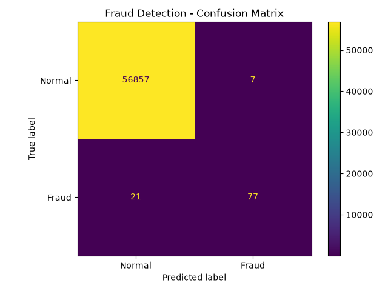
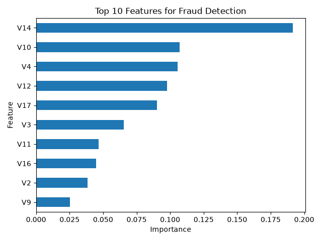

# 💳 AI Fraud Detection System

A machine learning-based credit card fraud detection system developed using Python, Scikit-learn, Random Forest, and Streamlit.

The project analyzes anonymized credit card transactions and classifies them as **Normal** or **Fraudulent**.

---

## 🚀 Project Overview

Credit card fraud detection is an important machine learning problem, especially in banking and financial systems.

The main goal of this project is to build an end-to-end fraud detection pipeline including:

- Data analysis
- Data preprocessing
- Train/test splitting
- Machine learning model training
- Fraud prediction
- Model evaluation
- Feature importance analysis
- Interactive web interface

---

## 📊 Dataset

The project uses the **Credit Card Fraud Detection** dataset.

Dataset statistics:

- Total transactions: **284,807**
- Normal transactions: **284,315**
- Fraudulent transactions: **492**
- Fraud rate: approximately **0.17%**

The dataset is highly imbalanced, which makes fraud detection more challenging.

The features **V1–V28** are anonymized PCA-transformed variables.

Additional variables include:

- `Time`
- `Amount`
- `Class`

Where:

- `Class = 0` → Normal transaction
- `Class = 1` → Fraudulent transaction

The large `creditcard.csv` dataset is not included in this repository.

---

## 🤖 Machine Learning Model

The project uses a:

**Random Forest Classifier**

The dataset is divided into:

- **80% Training Data**
- **20% Testing Data**

Stratified sampling is used to preserve the fraud/normal class distribution.

---

## 📈 Model Performance

Performance on the held-out test set:

| Metric | Result |
|---|---:|
| Accuracy | 99.95% |
| Precision | 91.67% |
| Recall | 78.57% |
| F1 Score | 84.62% |

Because the dataset is highly imbalanced, **Precision, Recall and F1 Score** are especially important when evaluating the model.

---

## 🔍 Confusion Matrix

The model produced the following results on the test set:

- True Negatives: **56,857**
- False Positives: **7**
- False Negatives: **21**
- True Positives: **77**



---

## 🧠 Feature Importance

Random Forest feature importance was used to examine which transformed features contributed most to model decisions.

The most important feature in the trained model was **V14**.



Because V1–V28 are anonymized PCA-transformed features, they cannot be directly interpreted as original banking variables.

---

## 🌐 Streamlit Web Application

The project includes an interactive Streamlit dashboard.

The application allows a user to:

- Select a transaction from the dataset
- View the transaction amount
- Analyze the transaction with the trained model
- View the model prediction
- View the model fraud score
- Compare the prediction with the dataset label
- Examine the confusion matrix
- Examine feature importance

The displayed fraud score is the classifier's model output and should not be interpreted as a calibrated real-world probability of fraud.

---

## 🛠️ Technologies

- Python
- Pandas
- NumPy
- Scikit-learn
- Random Forest
- Matplotlib
- Joblib
- Streamlit
- Git
- GitHub

---

## 📁 Project Structure

```text
fraud-detection-system/
│
├── app.py
├── main.py
├── predict.py
├── check_data.py
├── fraud_model.pkl
├── confusion_matrix.png
├── feature_importance.png
├── transactions.csv
├── requirements.txt
├── .gitignore
└── README.md
```

`creditcard.csv` is excluded from Git using `.gitignore`.

---

## ⚙️ Installation

Clone the repository:

```bash
git clone https://github.com/silademir07/fraud-detection-system.git
```

Move into the project directory:

```bash
cd fraud-detection-system
```

Create a virtual environment:

```bash
python3 -m venv .venv
```

Activate it on macOS/Linux:

```bash
source .venv/bin/activate
```

Install the required libraries:

```bash
pip install -r requirements.txt
```

---

## ▶️ Running the Application

After placing `creditcard.csv` in the project directory, run:

```bash
streamlit run app.py
```

Then open the local Streamlit address shown in the terminal.

---

## ⚠️ Disclaimer

This project is developed for **educational and portfolio purposes**.

It is not a production banking fraud detection system and should not be used to make real financial decisions.

---

## 👩‍💻 Author

**Sıla Demir**

Computer Engineering Student